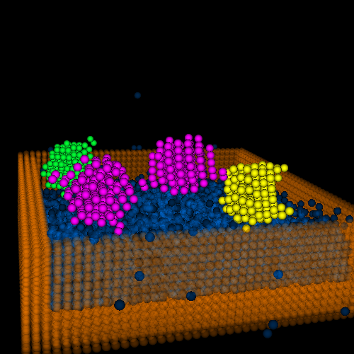
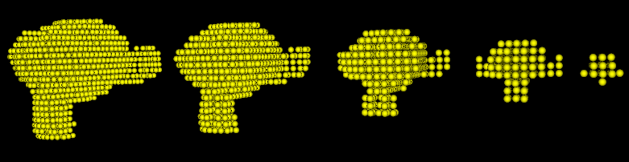
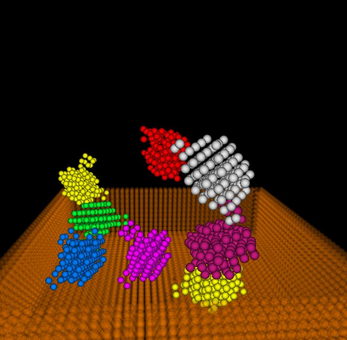
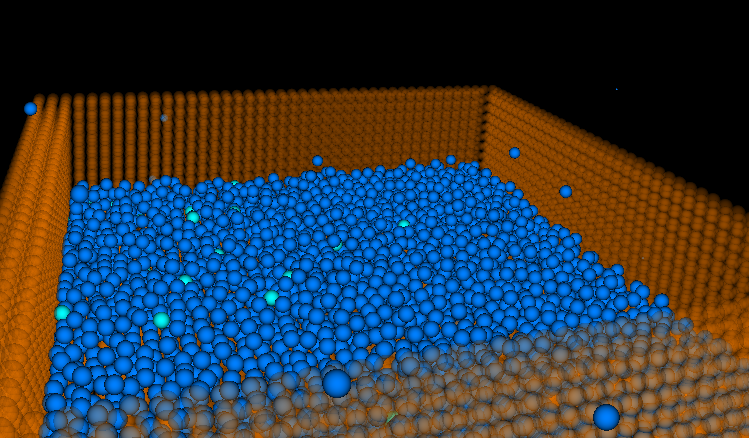

Unifided Real­time Particle Simulation Engine
===============

**University of Pennsylvania, CIS 565: GPU Programming and Architecture, Final Project**

* Tongbo Sui (Stonebird), Shuai Shao (shrekshao)

### Pitch
#### Overview

We are going to implement a real­time particle simulation engine. The engine would proposedly
include particle sampling, rigid body and fluid (gas or liquid) interactions. Preferably the engine would also include
particle meshing and shading via ray marching.

#### Application

Real­time particle simulation is useful for a wide range of purposes, especially for fields that needs
simulation demo for interactions among various bodies. For example, fluid simulation in games,
aerodynamics visualization, and meteorology simulation.

#### Proposed Pipeline

Preprocessing → Simulation → Vertex Shader (→ Geometry Shader / Meshing → Primitive Assembly
→ Rasterization) → Fragment Shader

* Preprocessing: load objects defined by vertices and primitives; convert them to particles with particle sampling
* Simulation: physical simulation of particle interactions
* Vertex shader: NDC conversion
* (Geometry shader): particle meshing
* (Primitive assembly): assemble meshed primitives
* (Rasterization): ordinary rasterization
* Fragment shader: simple ray marching for pipeline without meshing (assuming particles are uniform spheres)

#### Milestone Plan

* 11/16 Preprocessing, vertex shader, fragment shader (sphere ray marching)
* 11/23 Simulation (solvers)
* 11/30 Simulation (solvers)
* 12/07 Simulation (solvers) / Meshing

#### Analysis Plan

* Comparison on performance/effect with FPS, snapshot(resolution, iteration)
* Different particle sampling resolution
* Global vs Tile­based collision detection, ray cast, etc.
* Different iteration times numerically solving equations
* Time spent on different pipeline: rendering / simulation ...

#### Reference/Utils

* Main ref paper: Unified Particle Physics for Real­Time Applications
	* http://mmacklin.com/uppfrta_preprint.pdf
* NVIDIA CUDA Particle Tutorial:
	* http://docs.nvidia.com/cuda/samples/5_Simulations/particles/doc/particles.pdf
* GPU Gems3, rigid body particles: 
	* http://http.developer.nvidia.com/GPUGems3/gpugems3_ch29.html
* GPU Gems 3, fluid particle simulation:
	* https://developer.nvidia.com/gpugems/GPUGems3/gpugems3_ch30.html
* OpenGL for rendering
* Utils:
	* obj loader: https://github.com/syoyo/tinyobjloader , Or use obj loader in previous Proj
	* pcl(for particle system meshing): http://pointclouds.org/
	* Eigen: http://eigen.tuxfamily.org/index.php?title=Main_Page
	* cuBLAS: https://developer.nvidia.com/cublas
	
#### Presentation

* 11/16 Kick off, Framework setup, Rigid body sampling
	* https://docs.google.com/presentation/d/1nClJdx0G_EBylSQqkaYH11iI2RveZ4sG65v9emGyrXw/edit?usp=sharing
	
	
	
	
* 11/23 Milestone 2, Rigid body dynamics (some feature still buggy)
	* https://docs.google.com/presentation/d/1gCueC30LCkredTDXQ0NBadJjtKGnMahzDTzwR9Wir8Q/edit?usp=sharing
	

* 11/30 Milestone 3, Rigid body dynamics fix & Fluid (buggy)
	* https://docs.google.com/presentation/d/1Q2C6C9CmGP6BEkN0zQ6VC6oX3Jrzc6MLBNzf3XELtjU/edit?usp=sharing
	
	
	
	
	
#### Draft
* Preprocessing efficiency
* Numerical stability (polar decomp, matrix square root)
	* SVD - no; Jacobi - no
	* Denmann - yes, also converges fast
* Optimization
	* Change flow to avoid repetitive computations within kernel (extract to pre-process)
	* Optimize occupacy
	* Optimize memory access
		* Remove repetitive memory access to the same location within loops; reduce memory dependency