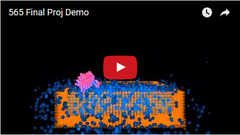
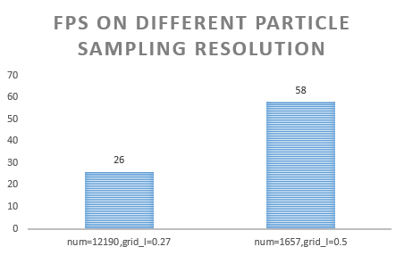
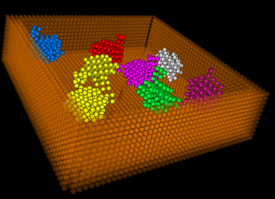
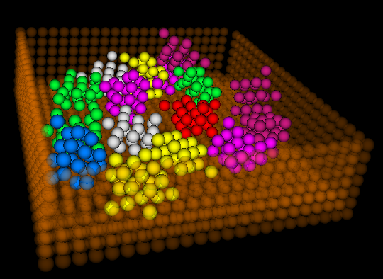

Unifided Real­time Particle Simulation Engine
===============

**University of Pennsylvania, CIS 565: GPU Programming and Architecture, Final Project**

* [Tongbo Sui (Stonebird)](https://www.linkedin.com/in/tongbosui), [Shuai Shao (shrekshao)](https://www.linkedin.com/in/shuai-shao-3718818b)

### Overview
A real­time particle simulation engine implemented with CUDA. The engine includes basic particle sampling, rigid body and fluid (liquid) interaction simulations.

* [slides](https://docs.google.com/presentation/d/1elaQLY8H8leIeWQ5LmkWcoFk5igO2OZbxhGEMvGc6X0/edit?usp=sharing)

### Demo video

### Installation and run
* Installation
	1. Copy the entire codebase into a folder
	2. Create a new folder inside it called `build`
	3. In CMake, point "source code" path to your codebase, point "build binaries" path to `build`
	4. In CMake, click "Configure" and then "Generate". Use "Visual Studio 12 2013" when prompted to choose a generator
	5. Open the generated solution under `build` in Visual Studio 2013 and set StartUp project to `cis565_final`
	6. Compile a desired build
* Run
	* Run with `./path-to-exe ../objs/suzanne.obj ../objs/sink.obj`
	* `objs` folder is in the top-level folder of the codebase. Please double check the relative path before running
	* `LMB`: rotate, `RMB`: translate, `Scroll`: zoom in/out

### Pipeline
1. Preprocessing
	1. Load objects into scene {A}
	2. Convert them to particles with particle sampling {3}{4}
		* Depth peeling: for each object, two depth maps are generated which maps the shallowest depth and the deepest depth respectively. Particles are filled between these two maps
2. Simulation (framework based on {1})
	1. Predict particle positions based on current velocity {1}
		* Simple position calculation `s = v * t`
	2. Adjust particle positions based on collision tests {1}
		* Collision happens for each pair of particles in the local context (voxel grid) where the two particles overlap
		* Adjustments are made for these collisions based on how deep these overlaps are
		* All adjustments are averaged to produce the final adjustment value for collision
	3. Retarget fluid particles {1}{5}{7}{8}{10}
		* Use incompressible density as the extra constraint for the fluid particle
		* Poly6 Smooth Kernel is used to calculate density at each point, Spiky Smooth Kernel is used for the gradients
		* Calculate lambda for each fluid particle
		* Apply incompressibility delta to predict positions
	4. Shape matching {1}{2}
		* Retarget particles for rigid bodies
		* Matching constraint is based on the fact that rigid bodies maintain their original shapes
		* Based on the deformation of particles of a rigid body, it is possible to find a transformation matrix that minimizes the difference between a transformed rigid body and its deformed particle states {1}
			* Calculation is based on polar decomposition {6}{7}
			* The general method for polar decomposition is used, where matrix square root is calculated first
		* Such transformation matrix is used to transform the rigid body such that its particles are retargeted to maintain the shape
	5. Update final prediction and find the corresponding velocity
		* Adjustments due to collision and retargeting are summed and averaged to produce the final adjustments
		* Original prediction value is adjusted based on the final values, and velocities are calculated
	6. Update particle information based on the final values
3. Render {9}
	* Particle rendering is accomplished with OpenGL built-in features
	* Render each particle as a point sprite, using the fragment shader to compute the distance to the center and get normal from texture coordinates to draw a sphere like point without using any actual geometry model

### Performance
* Preprocessing efficiency
	* Instead of generating two depth maps, particle sampling is performed in parallel via ray casting
	* Each ray is simply treated as z-axis unit vector, such that the ray casting is orthogonal
	* This saves time for map generation, and is equivalent to the original depth peeling algorithm
* Numerical stability
	* Numerical stability plays a critical role in polar decomposition. Unstablility will cause the decomposed result to be badly conditioned, therefore causing the rotation to be unreasonably big. Such wrong result would end up with huge velocities and cause object to "shoot" off the scene
	* SVD method seems to be very straight-forward, and can avoid calculating matrix square roots. However, the decomposed matrices are badly conditioned
	* The more stable way is to follow the general method where a matrix square root is calculated first. However, the Jacobi method for approximating matrix square root is numerically unstable, and would cause overflows after several iterations of the entire simulation. It is also very easy for Jacobi to fail on converging to a final result
	* Denman–Beavers iteration is finally used for finding matrix square root in that it's numerically stable, and converges very fast
	* Fluid simulation now is not able to reach a stable state, numerical stability is one potential reason. 
* Different particle sampling resolution
	* Sampling resolution has a magnificent impact on the performance, since the complexity is `O(n^3)` for the resolution on one axis.
	* A doubled grid length will lead to a considerable improvement on the performance, meanwhile keep the simulation result at the same level.
	
	
	
	|high resolution (grid length = 0.27f) | low resoultion (grid length = 0.5f) |
	|--------------------------| --------------------|
	| | |
	
* Number of Rigid Bodies
	* Shape matching is done sequentially for each rigid body
	* With same number of particles, simulation slows down as number of rigid body increases
	
* Global vs Voxel­based collision detection
	* For a standard test scene, the number of particles often goes up to 10,000+. It is obvious that the shorter collision test is, the better
	* For global collision tests, the complexity is stable at average case `O(n^2)` per thread. For a typical scene, this would render a loop size of 100,000,000+, which is infeasibly slow
	* One assumption can be given to the collision test that particles that are too far away must not be colliding. Therefore we can check only locally, reducing greatly the computatino complexity from polynomial to almost constant
	* Given the assumption above, particles are indexed into voxels, and for each particle during collision test, it will only test against those inside adjacent voxels. Each voxel has a fixed size, which in turn guarantees that collision test loop size will not exceed a constant
	* This effectively reduces loop size from 100,000,000+ to 150+
* Time spent on different pipeline stages
	* The most time-consuming parts are collision test and fluid retargeting. Both needs to serially check surrounding particles for information updates
	* As mentioned below, it is theoretically possible to parallelize these processes to increase overall performance. Preliminary trials showed a potential of ~70% execution time reduction (3.3x speedup) when local tests are parallelized

	|Time spent on different pipeline stages |
	|--------------------------|
	| |
* Fluid stablizing
	* We are now unable to achieve a stablized fluid simulation due to time limitation
	* Possible reasons we can further look into are
		* numerical stability
		* scale sensibility
		* successive over-relaxation parameter

### Optimization
* Occupancy
	* Explicitly reuse variables and optimize the computation flow to reduce # of registers used for kernels. Changing of computation flow should not add extra computations
	* Less registers gives more space to add more warps. By optimizing block size based on profiler statistics, it's possible to increase occupacy, and reduce kernel execution time
	* The part that get the most benefit is memory access, where having more warps allow more hiding of such delays
	* For simulation kernels, generally such optimization will reduce 15% execution time
* Change flow to avoid repetitive computations within kernel
	* Some computations can produce expected results that can be decided upon initialization
	* Extract such computations to pre-processing so that simulation kernels don't have to spend time on them
	* Since there aren't many places for this kind of optimization, the improvement is small
* Optimize memory access
	* Repetitive memory access to the same location within loops causes significant memory throttling, which is an important reason to slow kernels even with L1 caching
	* Replace such access by creating variables outside loops to cache the values to be used repetitively inside loops. This will eliminate memory throttling and reduce memory dependency by a large amount (~10%)
	* ~10% reduction on execution time
* Flatten loops into separate threads, or kernel within kernel
	* For each particle, the collision test requires checking locally all particles around it. This involves huge loops inside kernel for each thread
	* It is theoretically possible to break the loops into separate threads. This would require stable concurrent updates to same memory locations
		* Locking: locking is extremely slow. It's not hard to imagine the reason why it's slow given the # of particles
		* Atomic operations: faster than locking but still super slow. After all, it involves some hardware locks that decreases performances
	* One possible way to do this is to break into two steps
		* The first step involves writing to a larger array, where all threads only write to its own cell
		* Second step is to add the results for each loop all together, producing the final (smaller) array
		* *However*, we haven't been able to accomplish such optimizations without rendering the result incorrect. Thus it's a possible future improvement

### References
* {1} Macklin, Miles, et al. "Unified particle physics for real-time applications." ACM Transactions on Graphics (TOG) 33.4 (2014): 153.
* {2} Müller, Matthias, et al. "Meshless deformations based on shape matching." ACM Transactions on Graphics (TOG). Vol. 24. No. 3. ACM, 2005.
* {3} NVIDIA CUDA Particle Tutorial [pdf](http://docs.nvidia.com/cuda/samples/5_Simulations/particles/doc/particles.pdf)
* {4} Rigid body particles, GPU Gems 3 [page](http://http.developer.nvidia.com/GPUGems3/gpugems3_ch29.html)
* {5} Fluid particle simulation, GPU Gems 3 [page](https://developer.nvidia.com/gpugems/GPUGems3/gpugems3_ch30.html)
* {6} Polar decomposition, Wikipedia [page](https://en.wikipedia.org/wiki/Polar_decomposition)
* {7} Matrix square root, Wikipedia [page](https://en.wikipedia.org/wiki/Square_root_of_a_matrix)
* {8} Müller, Matthias, "Position Based Fluids." ACM Transactions on Graphics (TOG) 32
* {9} OpenGL Point Sprite Rendering [link](http://mmmovania.blogspot.com/2011/01/point-sprites-as-spheres-in-opengl33.html)
* {10} VanVerth Fluid Techniques [pdf](http://www.essentialmath.com/GDC2012/GDC2012_JMV_Fluids.pdf)

### Utils
* {A} Tinyobjloader [repo](https://github.com/syoyo/tinyobjloader)

### Original Project Pitch
#### Overview

We are going to implement a real­time particle simulation engine. The engine would proposedly
include particle sampling, rigid body and fluid (gas or liquid) interactions. Preferably the engine would also include
particle meshing and shading via ray marching.

#### Application

Real­time particle simulation is useful for a wide range of purposes, especially for fields that needs
simulation demo for interactions among various bodies. For example, fluid simulation in games,
aerodynamics visualization, and meteorology simulation.

#### Proposed Pipeline

Preprocessing → Simulation → Vertex Shader (→ Geometry Shader / Meshing → Primitive Assembly
→ Rasterization) → Fragment Shader

* Preprocessing: load objects defined by vertices and primitives; convert them to particles with particle sampling
* Simulation: physical simulation of particle interactions
* Vertex shader: NDC conversion
* (Geometry shader): particle meshing
* (Primitive assembly): assemble meshed primitives
* (Rasterization): ordinary rasterization
* Fragment shader: simple ray marching for pipeline without meshing (assuming particles are uniform spheres)

#### Milestone Plan

* 11/16 Preprocessing, vertex shader, fragment shader (sphere ray marching)
* 11/23 Simulation (solvers) Rigid Body
* 11/30 Simulation (solvers) Fluid
* 12/07 Simulation (solvers) / ~~Meshing~~
	
#### Presentation

* 11/16 Kick off, Framework setup, Rigid body sampling
	* https://docs.google.com/presentation/d/1nClJdx0G_EBylSQqkaYH11iI2RveZ4sG65v9emGyrXw/edit?usp=sharing
	
	
	
	
* 11/23 Milestone 2, Rigid body dynamics (some feature still buggy)
	* https://docs.google.com/presentation/d/1gCueC30LCkredTDXQ0NBadJjtKGnMahzDTzwR9Wir8Q/edit?usp=sharing
	

* 11/30 Milestone 3, Rigid body dynamics fix & Fluid (buggy)
	* https://docs.google.com/presentation/d/1Q2C6C9CmGP6BEkN0zQ6VC6oX3Jrzc6MLBNzf3XELtjU/edit?usp=sharing
	
	
	
	

* 12/7 Milestone 3, Fluid Debug (dirty) & optimization
	* https://docs.google.com/presentation/d/1Fz22_-5cNkKcdmKvkFU1XlUkZOABJLExdBBK6ca5ImA/edit?usp=sharing
	
	
